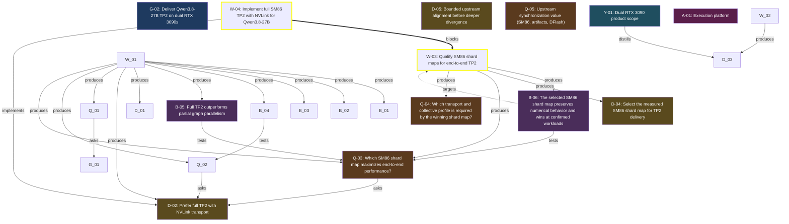

<!-- AUTO-GENERATED by grove. Do not edit. Run `grove render` to refresh. -->

# Development dashboard

## Content health

| Measure | Count | Composition |
| --- | --- | --- |
| C (content) | 3 | validated B 0 · answered Q 1 · accepted D 1 · active Discovery 1 |
| V (uncertainty) | 6 | open Q 2 · pending B 2 · W below DoR 0 · uncovered surface 2 |

## Areas

| Area | Title | C (content) | V (uncertainty) | Composition |
| --- | --- | --- | --- | --- |
| A-01 | Execution platform | 1 | 5 | C: validated B 0 · answered Q 0 · accepted D 1; V: open Q 2 · pending B 1 · W below DoR 0 · uncovered surface 2 |

> Relevance view, not a partition: a node touching two areas counts in both; a W without goals counts in none. The Content health totals above are primary.

## Goals

| ID | Outcome | Fitness function | Status |
| --- | --- | --- | --- |
| G-02 | Deliver Qwen3.8-27B TP2 on dual RTX 3090s | count; current= target=2 | unverified |

## Work items

| ID | Type | Title | Goals | Cynefin | DoR | Status | Critical |
| --- | --- | --- | --- | --- | --- | --- | --- |
| W-03 | spike | Qualify SM86 shard maps for end-to-end TP2 | G-02 | complex | ⊤ | ready | ★ |
| W-04 | feature | Implement full SM86 TP2 with NVLink for Qwen3.8-27B | G-02 | complicated | ⊤ | progress | ★ |

## Decisions

| ID | Title | Status | Supersedes |
| --- | --- | --- | --- |
| D-02 | Prefer full TP2 with NVLink transport | accepted |  |
| D-04 | Select the measured SM86 shard map for TP2 delivery | proposed |  |
| D-05 | Bounded upstream alignment before deeper divergence | rejected |  |

## Open questions

| ID | Question | Cynefin | Targets | Status |
| --- | --- | --- | --- | --- |
| Q-03 | Which SM86 shard map maximizes end-to-end performance? | complex | D-02 | open |
| Q-04 | Which transport and collective profile is required by the winning shard map? | complicated |  | open |
| Q-05 | Upstream synchronization value (SM86, artifacts, DFlash) | complicated |  | answered |

## Assumptions

| ID | Assumption | Tests | Targets | Status |
| --- | --- | --- | --- | --- |
| B-05 | Full TP2 outperforms partial graph parallelism | Q-03 |  | proposed |
| B-06 | The selected SM86 shard map preserves numerical behavior and wins at confirmed workloads | Q-03 | W-03 | proposed |

## Discoveries

| ID | Title | Tags | Status |
| --- | --- | --- | --- |
| Y-01 | Dual RTX 3090 product scope | nvlink, product-contract, tp2 | active |

## Dependency graph

